# Introduction

`ViewPoly` is a shiny app and R package for visualizing and exploring results from [polyploid computational tools](https://www.polyploids.org/) using an interactive graphical user interface. The package allows users to directly upload output files from [polymapR](https://cran.r-project.org/web/packages/polymapR/index.html), [MAPpoly](https://cran.r-project.org/web/packages/mappoly/index.html), [polyqtlR](https://cran.r-project.org/web/packages/polyqtlR/index.html), [QTLpoly](https://cran.r-project.org/web/packages/qtlpoly/index.html), [diaQTL](https://github.com/jendelman/diaQTL) and genomic assembly, variants, annotation and alignment files. VIEWpoly uses [shiny](https://cran.r-project.org/web/packages/shiny/index.html), [golem](https://cran.r-project.org/web/packages/golem/index.html), [ggplot2](https://cran.r-project.org/web/packages/ggplot2/index.html), [plotly](https://cran.r-project.org/web/packages/plotly/index.html), and [JBrowseR](https://cran.r-project.org/web/packages/JBrowseR/index.html) libraries to graphically display the QTL profiles, positions, alleles estimated effects, progeny individuals containing specific haplotypes and their breeding values. It is also possible to access marker dosage and parental phase from the linkage map. If genomic information is available, the corresponding QTL positions in be interactively explored using JBrowseR interface, allowing the search for candidate genes. It also provides features to download specific information into comprehensive tables and images for further analysis and presentation.

The app is organized in four modules: `Input data`, `QTL`, `Genome` and `Map`.

# Install and run the app

Use the follow code to install and run the app.


```r
devtools::install_github("mmollina/viewpoly")
viewpoly::run_app()
```

Each one of the modules here described can be accessed clicking in the top menu:

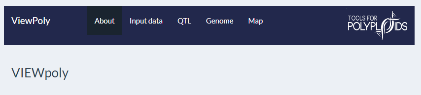

# Input data

Use this module to select an example dataset or to upload yours. 

For uploading your data:

* Submit files for one linkage map building software or the standard format file in `Upload linkage map`. If you submit files for more than one option just the last one will be considered. Once you submit, the map-related features will be already available, you can access them in the `Map` tab.

* Submit files for one linkage map building software or the standard format file in `Upload linkage map`. If you submit files for more than one option just the last one will be considered. Once you submit, the QTL-related features will be already available, you can access them in the `QTL` tab.

* If you submit both linkage map and QTL analysis results, the submitted linkage map must be the same one used to perform the QTL analysis.

* Submit genome information files in `Upload Genome Browser files`. The FASTA file is the only required to access the `Genome` tab features, the others (GFF3, VCF, BAM, WIG) are optional. All uploaded files genome version must be the same one used to build the genetic map. The features in `Genome` tab will only be displayed if linkage map information was also submitted trough `Upload linkage map` or `Upload VIEWpoly dataset`.

The app will convert the uploaded files from `Upload linkage map` and `Upload QTL analysis` sessions into the VIEWpoly file format. You can download it using the `Download VIEWpoly dataset` session. Therefore, in a future access to this app, you need to upload just a single file to access the QTL and Map modules app features for this dataset. VIEWpoly files can be uploaded in `Upload VIEWpoly dataset`. You can also just load the VIEWpoly object in your R environment (code: `load("my_dataset.RData")`) that VIEWpoly will identify and list it in the `Upload VIEWpoly dataset` session. The VIEWpoly object does not store genome information, these files will need to be uploaded again.

## Available example datasets

Linkage map, QTL analysis results from previous studies are available together with the package:

* [Tetraploid potato - Atlantic x B1829-5](https://www.nature.com/articles/s41437-021-00416-x)
* [Hexaploid sweetpotato - Beauregard x Tanzania](https://academic.oup.com/genetics/article/215/3/579/5930535)

To save space in the package repository, they contain the entire linkage map and QTL analysis but just a subset of individuals and the genome information (FASTA and GFF3).

You can select one of them to explore the software features before upload your own data. By default, the app will display the tetraploid potato dataset. 

## Upload linkage map files

### Upload MAPpoly or polymapR output

Click in the `+` on the right side of the `Upload linkage map files` box to open the options for uploading the linkage map information. 

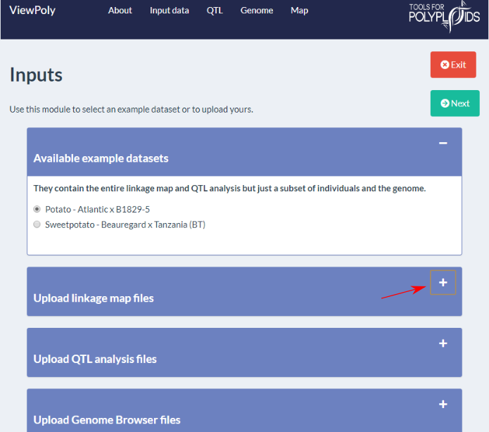

Click in one the the `+` inside the box to select with type of input: from MAPpoly, polymapR or standard format.

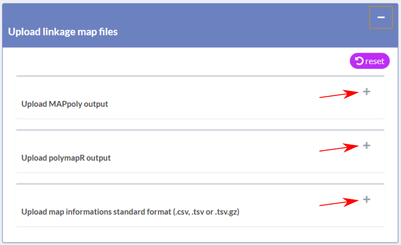

Once you open one of them, you can see instructions about how should be the files uploaded into this spot. In the example bellow, it is expected an RData file containing an R object of class `mappoly.map`. The provided link points to the MAPpoly tutorial, where you can find further information about all the procedure to build a linkage map and to obtain this specific object.

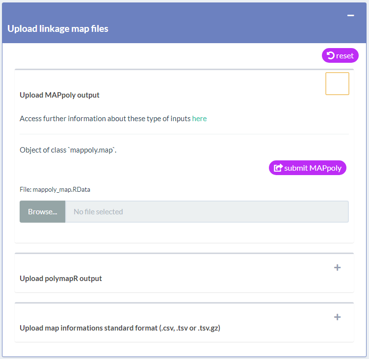

Click in `Browse...` to search for the file in your computer and load it into the app.

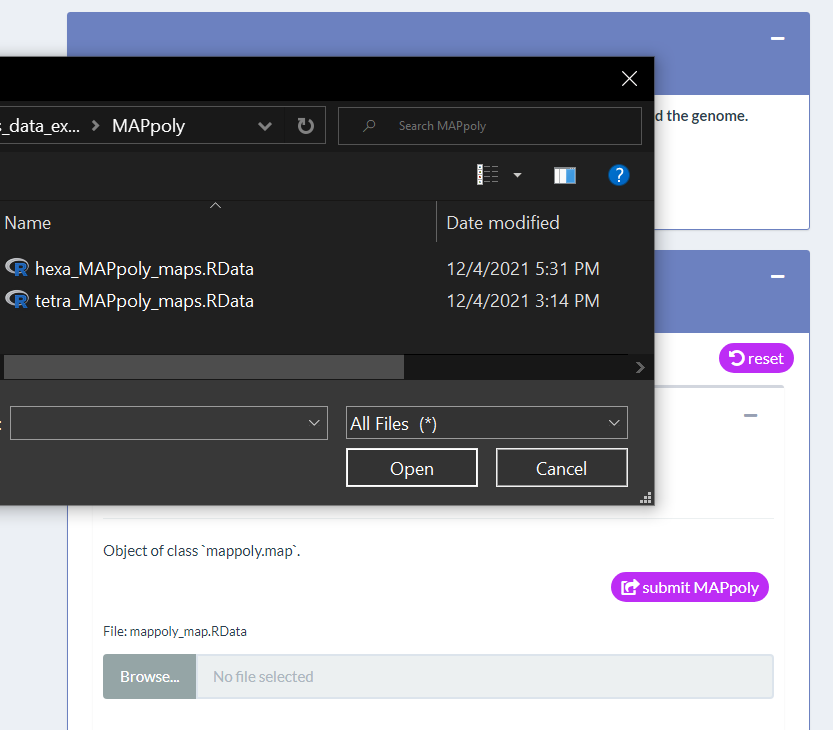

Wait for the upload be complete and click in the submit button (in this case:`submit MAPpoly`):

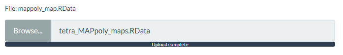

After clicking submit, if you want to change any of the uploaded files, you must click in `reset` button before new files.

### Upload map informations stardard format (.csv, .tsv or tsv.gz)

If you choose to submit the linkage map files standard formats you can download example files to set the right formats with your data:

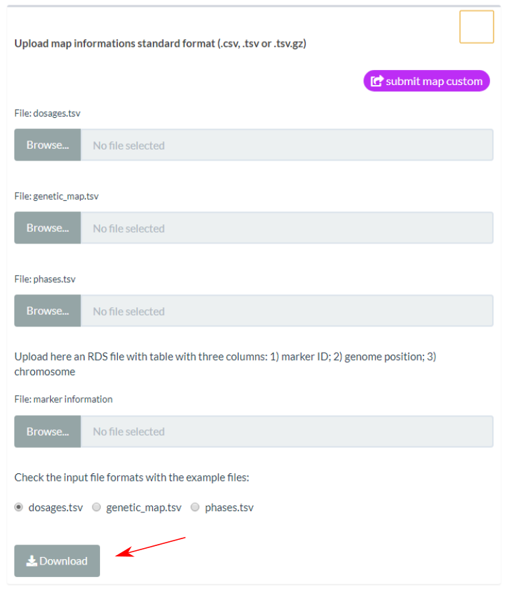

## Upload QTL analysis files

### Upload QTLpoly, diaQTL or polyqtlR output

Pick one of the options and click on the `+` on the right side of the box to open the description of the required files.

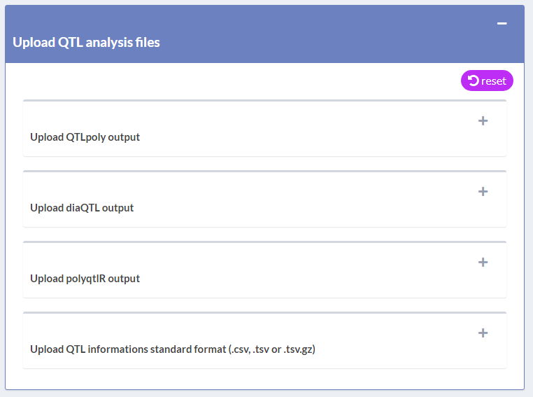

From the QTL analysis at least four files are required. The example code shows the functions the required object come from. After loading all required files, click in submit button:

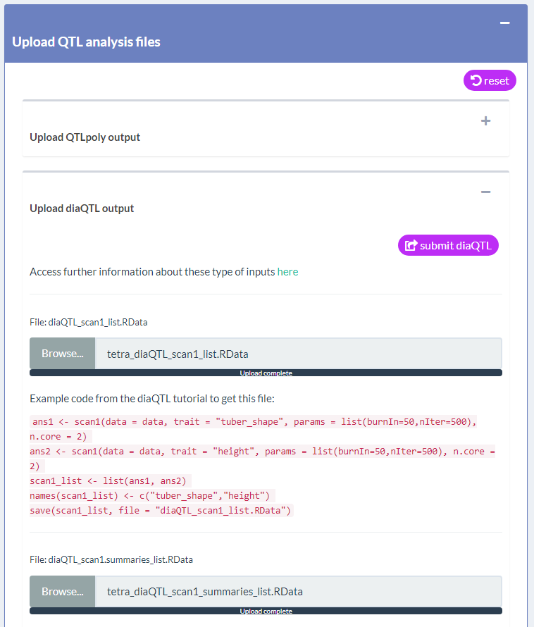

### Upload QTL informations standard format (.csv, .tsv or .tsv.gz)

If you choose to submit the QTL analysis files with standard formats you can download example files to set the right formats with your data:

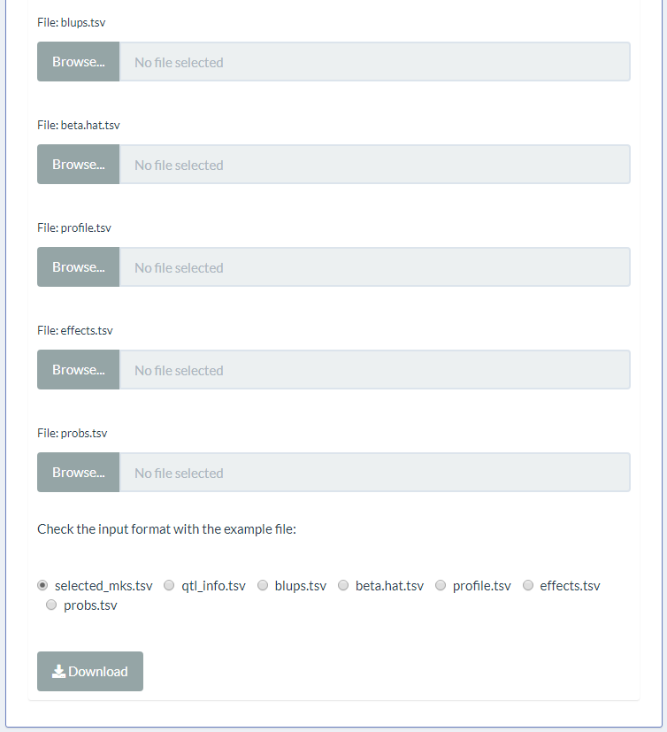

## Upload Genome Browser files 

Uploading files in this session will open access to the `Genome` tab features. The files are included as tracks into the [JBrowseR](https://gmod.github.io/JBrowseR/) tool. Only the assembly (FASTA) file is required to access the feature, the others are optional.

* Assembly 

You can compress the FASTA file using [bgzip](http://www.htslib.org/doc/bgzip.html) with:


```bash
bgzip NSP306_trifida_chr_v3.fa
```

You must submit also the indexes files generated by [samtools](https://samtools.github.io/). 


```bash
samtools faidx NSP306_trifida_chr_v3.fa.gz
```

After this, you can submit the three files at once in the app:

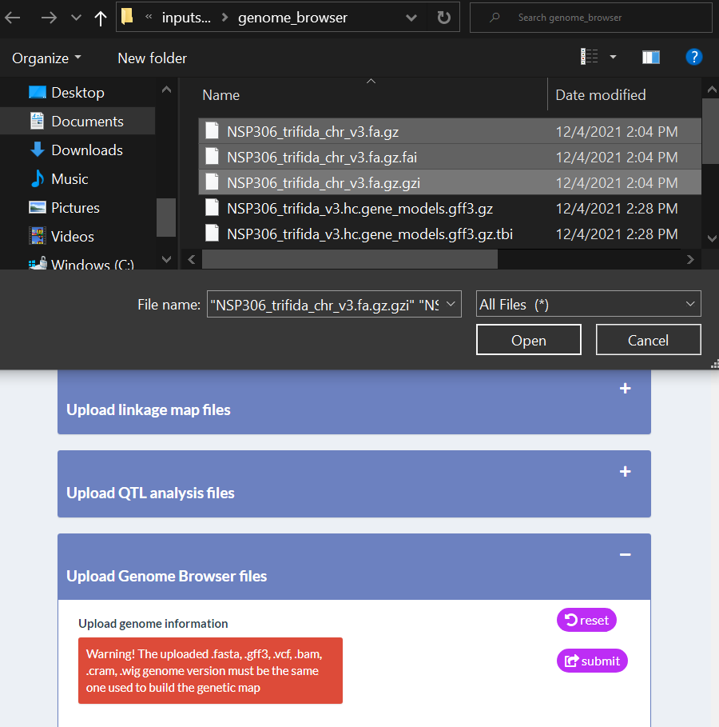

* Annotation 

You may need to sort your annotation file before upload it. One way of doing it is using [gff3sort](https://github.com/billzt/gff3sort) tool:


```bash
gff3sort.pl --precise --chr_order natural NSP306_trifida_v3.hc.gene_models.gff3 | bgzip > NSP306_trifida_v3.hc.gene_models.sorted.gff3.gz 
```

And generated the indexes with [tabix](http://www.htslib.org/doc/tabix.html):


```bash
tabix -p gff NSP306_trifida_v3.hc.gene_models.sorted.gff3.gz
```

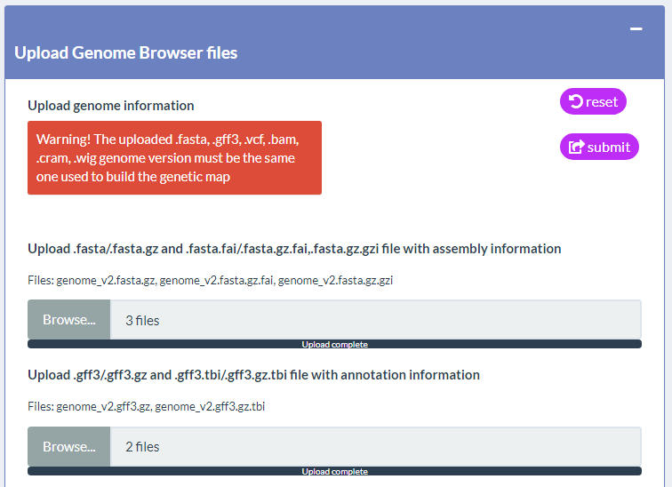

* Variants

The VCF file should also be tabixed: 


```bash
tabix -p variants.vcf
```

* Alignment

Alignment files BAM should be together with BAI or CSI files, and for CRAM files only CRAI is allowed.

For creating BAI index:


```bash
samtools index *.bam
```

* bigWig

No index files are required.

Check further information in [JBrowse documentation](https://jbrowse.org/jb2/docs/user_guide/).

## Download VIEWpoly dataset

Once you submitted the linkage map and QTL analysis results, VIEWpoly converts all files to a single R object of class `viewpoly`. It keeps only the information required for building the app graphics. You can set a name of the dataset R object using the box. Avoid using special characters or spaces. Click in `Download` to save as a RData object.

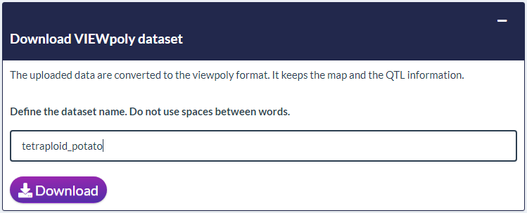

## Upload VIEWpoly dataset

Next time you want to access VIEWpoly features for this dataset you can just submit this single file in the `Upload VIEWpoly dataset` session:

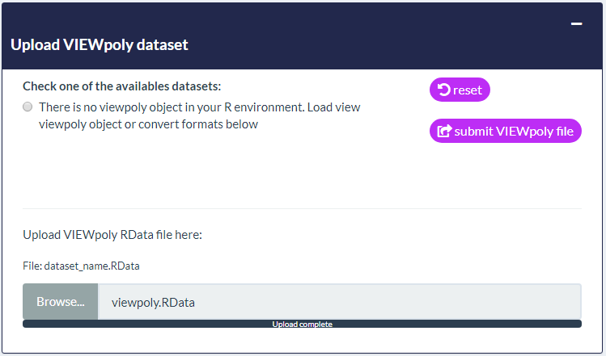

You can also load your VIEWpoly dataset in your R environment and it will be listed in this session.


```r
load("viewpoly.RData")
viewpoly::run_app()
```

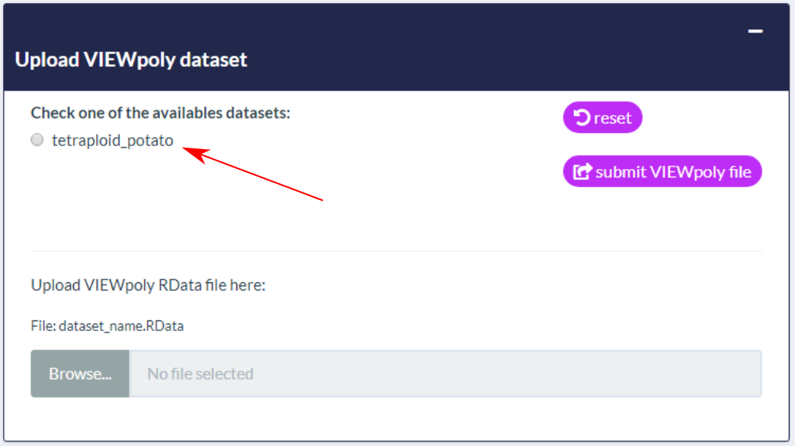

If you have more than one VIEWpoly dataset available in your R environment, all them will be listed:

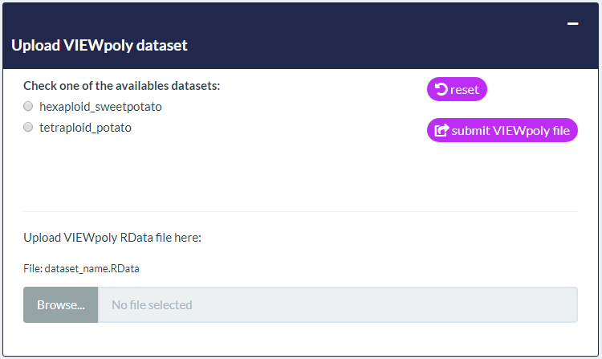

Don't forget to press `submit` after uploading the file or choosen the listed dataset. After, you can go back to `Upload Genome Browser files` to upload the genome information for this selected dataset.

# QTL Browser

If you uploaded the QTL analysis information for any of the software options, you can access the features in the `QTL` tab. If you didn't upload anything, the tetraploid potato analysis example will be displayed, you can also select the hexaploid example in the `Input data` tab.

## Select linkage groups and phenotypes

You can explore any of the linkage groups or the phenotypes together or separated. Select them using the two upper boxes:

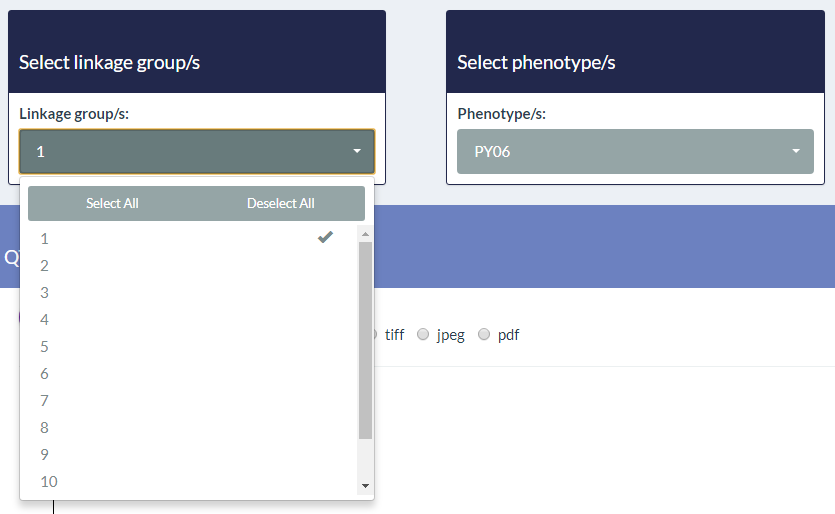

## QTL profile

Once you selected the group and phenotypes, the QTL profile curve will be plotted. It shows a measure of statistical significance (that can be different according to software used)(y-axis) of the trait (colors) for each map position (x-axis). The triangles in the bottom part points to the peak of the significance and QTL position, the black line crossing the triangle define the QTL confidence interval.

If you uploaded data from **QTLpoly** you will see a graphic like this:

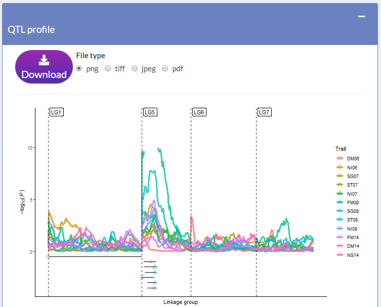

If you uploaded data from **diaQTL** you will see a graphic like this:

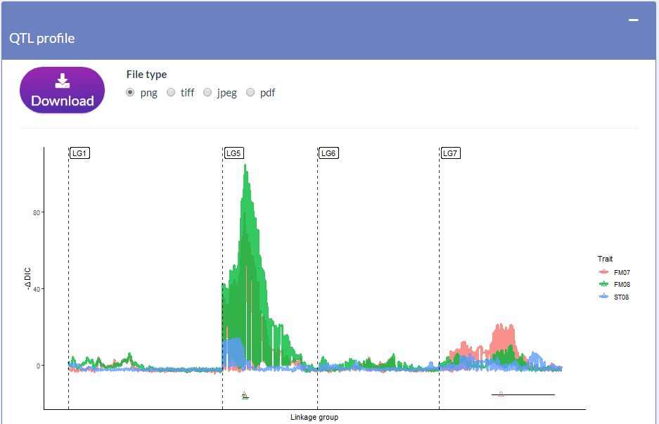

If you uploaded data from **polymapR** you will see a graphic like this:

You can download this figure and all other figures from VIEWpoly selecting the format in the `file type` field and pressing the `Download` button just on top of each figure.

For further information about this graphics, please check [QTLpoly](), [diaQTL]() and [polymapR]() tutorials.

### Effects

You can brush your mouse to select the triangles in the bottom of the graphic to explore particular QTL effects progeny haplotypes, breeding values and to get the QTL summary table in the next sessions:


WARNING: If you want to change the linkage group or phenotype evaluated first deselect the triangles (single click any other location of the graphic). Not doing this will crash the app.

Click in the `+` in the right corner of the `Effects` session to see the graphics. By default, VIEWpoly displays the `bar` design:

* Additive (bar)

If you uploaded QTL data from **QTLpoly**, you will see something like this:

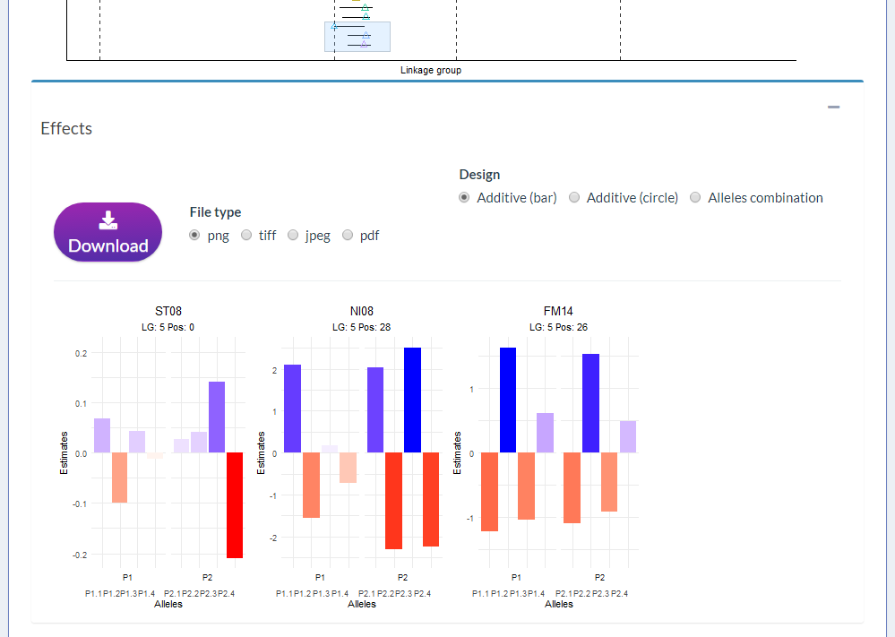

It displays the additive effect for each of the parents alleles on the selected QTL positions. Colors enphasizes the effects intensity.

If you uploaded QTL data from **diaQTL**, you will see something like this:


Similarly with QTLpoly, but includes a bayesian confidence interval for the effects.

If you uploaded QTL data from **polymapR**, you will see something like this:


It plots the effects intensity across the entire linkage group for the selected QTL phenotype.

For further information about this graphics, please check [QTLpoly](), [diaQTL]() and [polymapR]() tutorials.


* Additive (circle)

Changing the `Design` to `Additive (circle)` the effects intensity are plotted in a circle graphic. The selected QTL from same linkage group are plotted together in the same graphic. To be possible to compare the effects across different QTL and phenotypes, the values are normalized to be between -1 (center or circle) and 1. The dots colors are more intense close to the extreme values (-1 and 1) and their transparency increase while close to 0. 

This design is only available for **QTLpoly** and **diaQTL** software results.

If you uploaded QTL data from **QTLpoly**, you will see something like this:

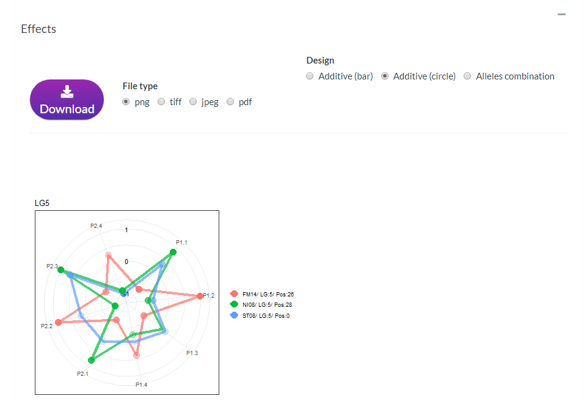

If you uploaded QTL data from **diaQTL**, you will see something like this:

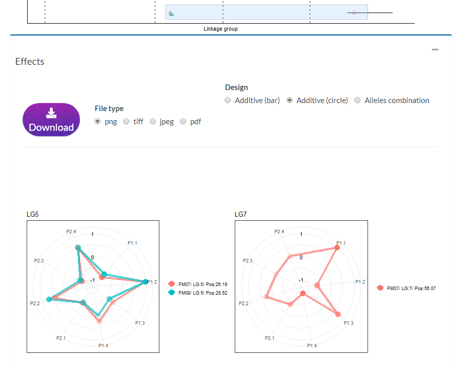

* Alleles combination

Changing the `Design` to `Alleles combination` a heatmap is plotted with the combined alleles (parents alleles x-axis x parents alleles y-axis) sum of additive and digenic effects in the upper diagonal and just the additive in the bottom diagonal. 

This design is only available for **QTLpoly** and **diaQTL** software results. 

If you uploaded QTL data from **QTLpoly**, you will see something like this:

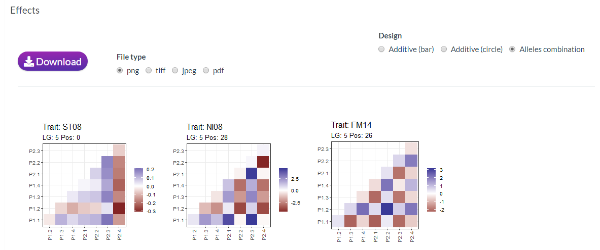

**QTLpoly** only considers additive effects.

If you uploaded QTL data from **diaQTL**, you will see something like this:

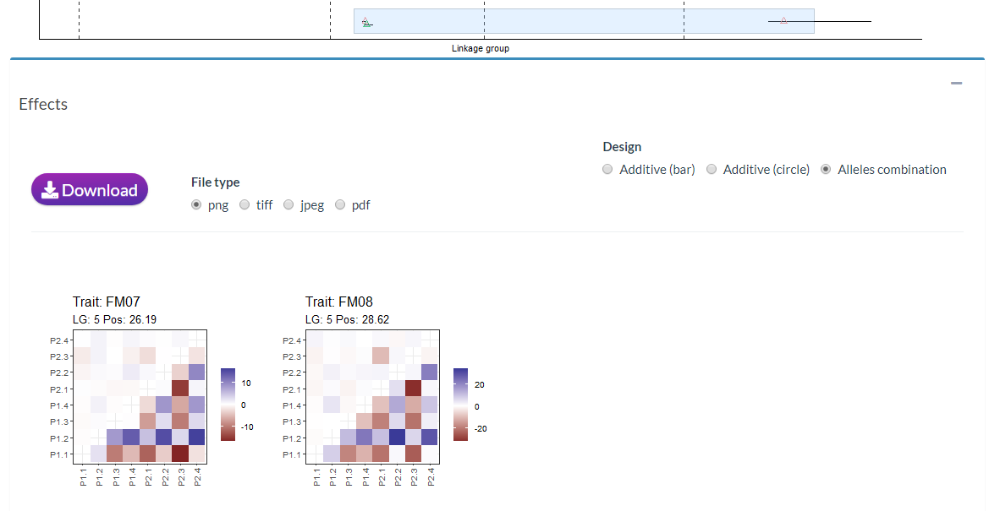

### Progenies haplotypes

To access this feature, first set the `Design` to `Additive (bar)`. By now, it is only implemented for results coming from **QTLpoly**.

Click in `update available haplotypes` button an after in the right corner of the `Select haplotypes` gray box, a window will open presenting all possible parents alleles for the QTL selected in the QTL profile graphic. You can select any combination of alleles and, after clicking in `submit seleted haplotypes`, VIEWpoly will search the individuals in the progeny that have a probability higher than 0.5 of having all the alleles selected.

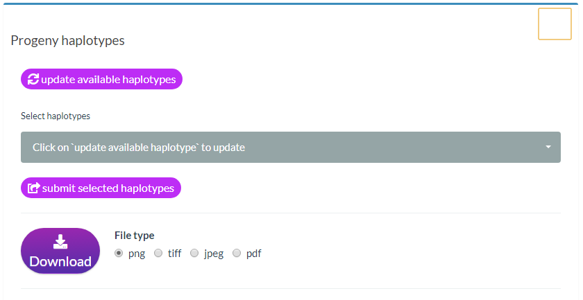

For example, here we selected the allele P1.1 and P2.2 in LG 5, position 0 referring to the QTL for trait ST08 (Trait:ST08_LG:5_Pos:0_homolog:P1.1; Trait:ST08_LG:5_Pos:0_homolog:P2.1), P1.2 in LG 5, position 28 referring to the QTL for trait NI08 (Trait:NI08_LG:5_Pos:28_homolog:P1.2) and P2.4 in LG 5, position 26 referring to the QTL for trait FM14 (Trait:FM14_LG:5_Pos:26_homolog:P2.3).

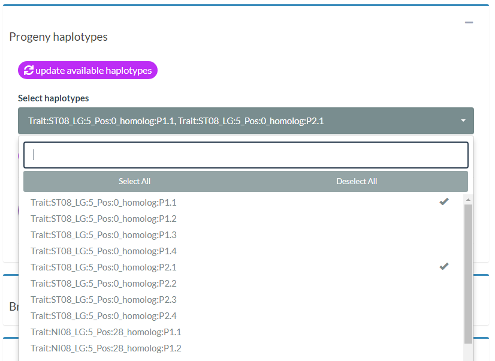

VIEWpoly displays the genotype probability profile for each individual identified with the selected alleles. The QTL position are pointed by dashed vertical lines. If only one linkage group is selected, the graphic will split vertically the probabilities for each possible homolog:

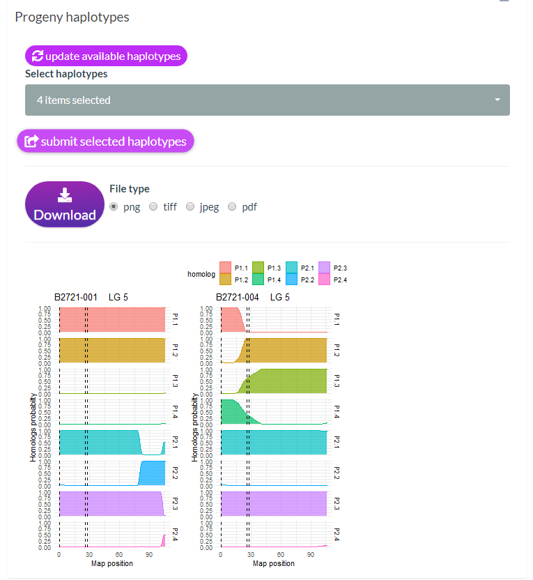

In case we include the QTL for trait NS06 in chromosome 1 and try to find also individuals that has the allele P1.1 in this QTL position:


Because two group must be represented in this case, the graphic design change to stacked version.

### Breeding values

This feature is only available for software **QTLpoly*. Only the effects of the selected QTL in the QTL profile graphic are considered to estimate the breeding values.

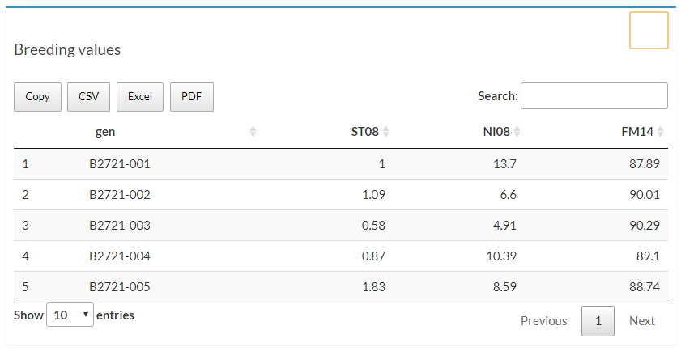

You can download the tables in VIEWpoly clicking in the top buttons. CSV, Excel and PDF formats are available. `Copy` will copy the table to your clipboard. 

### QTL summary

VIEWpoly also provide a table with the some of the main information about the selected QTL. This table also change according to the software used to evaluate the QTL.

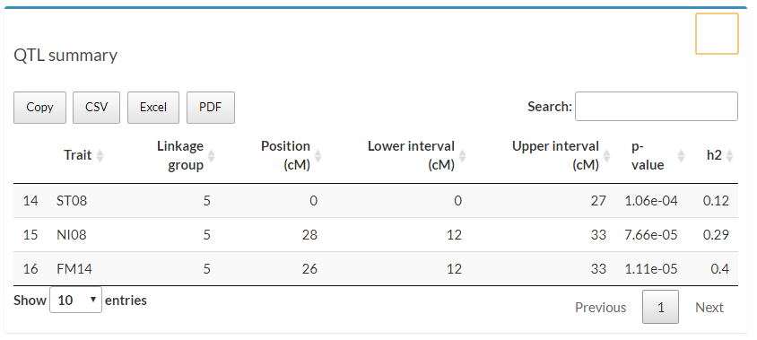

# Genome Browser

This module has the goal to relate the QTL position in the linkage map with the available genomic information. 

## Select phenotypes and linkage group

The visualization here are made defining a range in `Map range (cM)` session by chromosome. Therefore, you can select only one chromosome to be visualized at the time. You can also select the phenotypes then the QTL positions and confidence interval are plotted just bellow the range. The QTL profile graphic will be also available in `QTL profile` session.

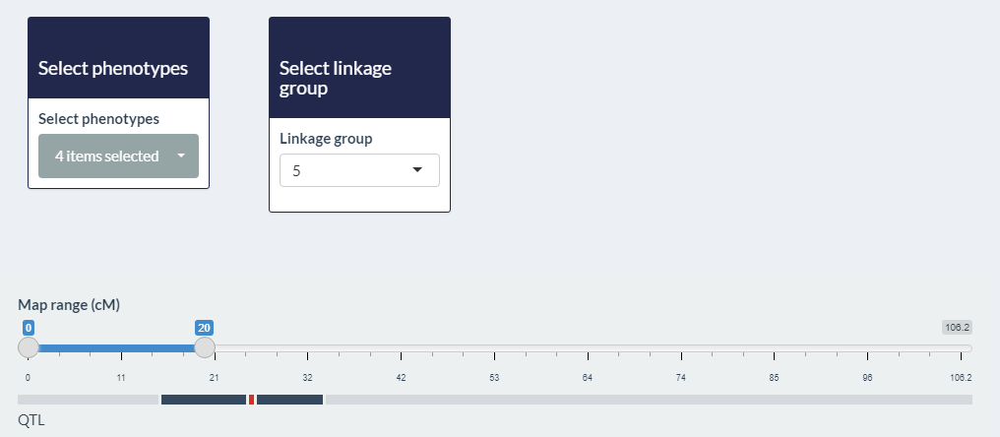

## QTL profile

Click on the `+` on the right corner of the `QTL profile` session to access a plotly graphic with the QTL significance profile.  

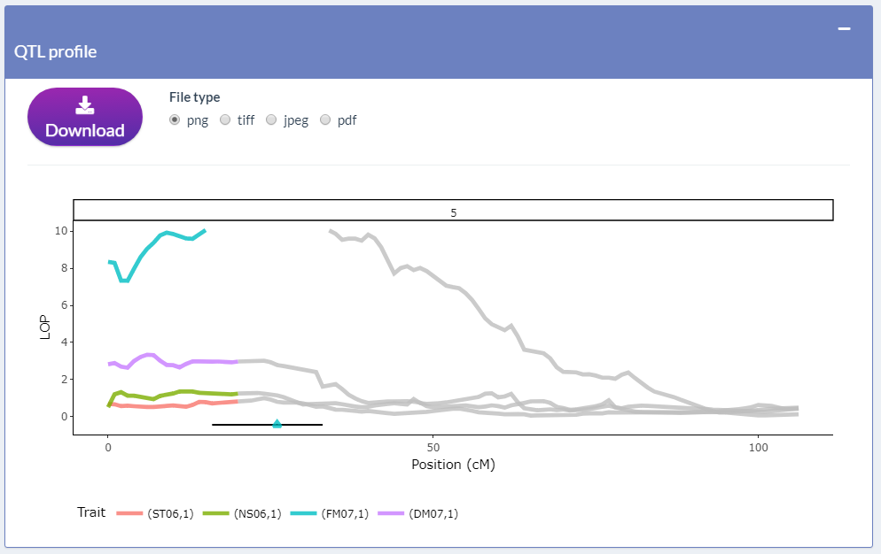

## Linkage Map position (cM) x Physical position (Mp)

This graphic related the linkage map position with the physical position. It highlight possible disagreements in marker position due to inversions or misplacement. 

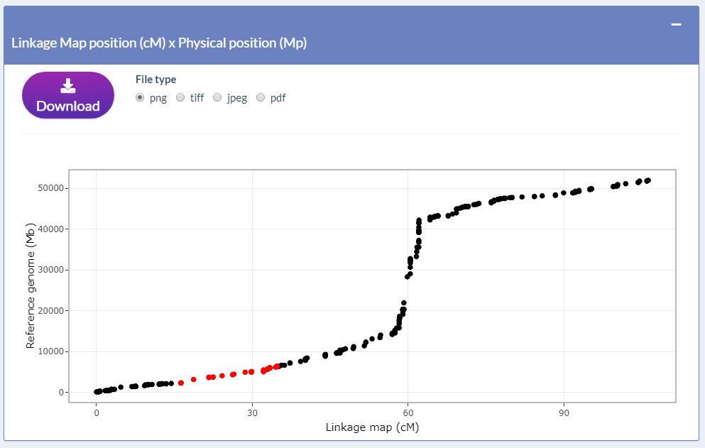

## JBrowseR

If you uploaded the genome information in the `Input data` tab, you can click on `Open JBrowseR` to visualize the genome and all the tracks according to the files uploaded:

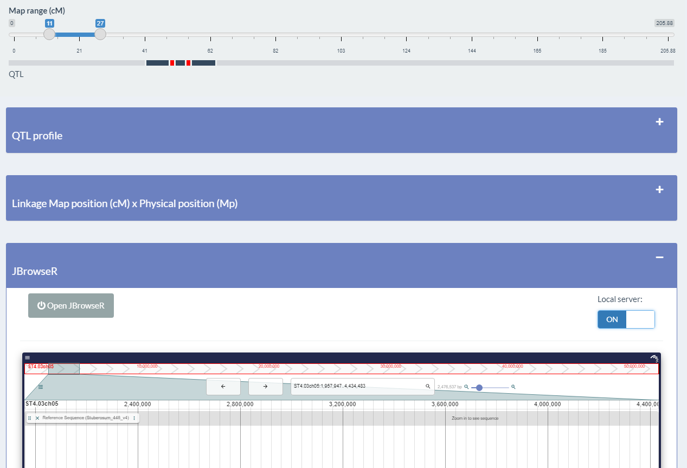

The range in the genome are set from the position of the first marker e to the position of the last marker in the selected linkage map range. 

Changing the range:


You can also explore all the JBrowse features clicking in the buttons inside the window. 
For example: or zoom in:

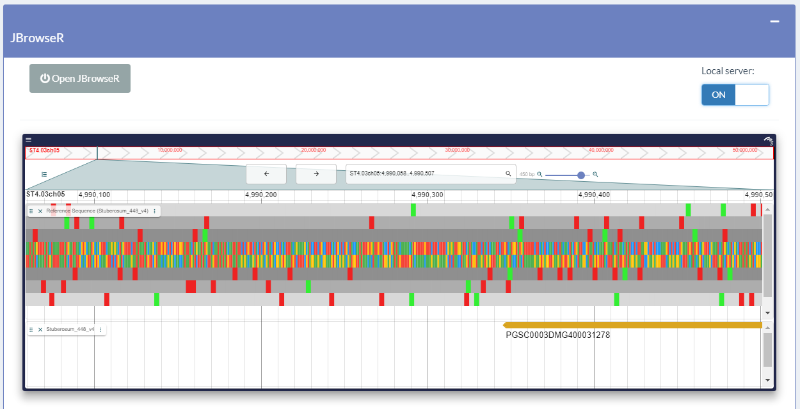

Access the menu clicking in the upper left corner:

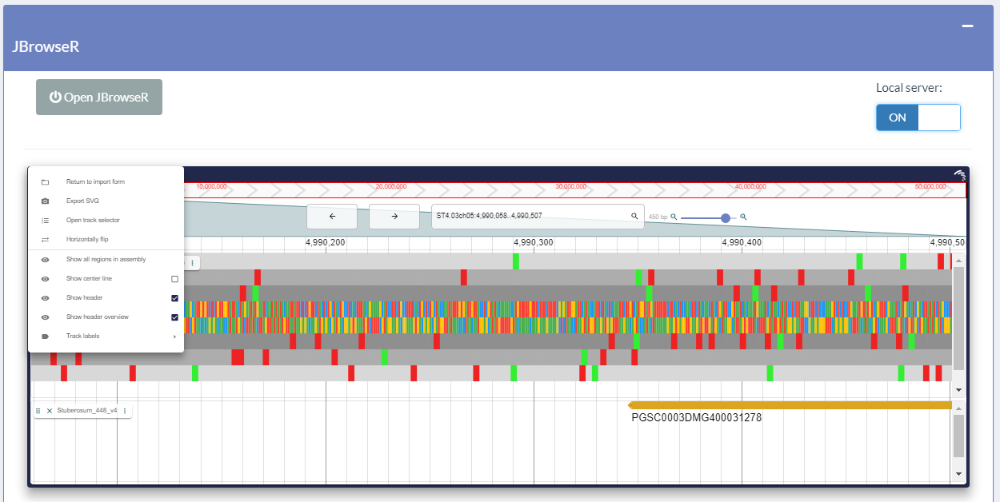

For further information about the JBrowseR features, please access [their documentation](https://jbrowse.org/jb2/docs/).

VIEWpoly creates a local server to host the genome files to JBrowseR be able to access it. Before exiting the app or changing the genome file you must turn off the generated server clicking in the button `Local server` session. If not, the server will only be off when you close or restart R.

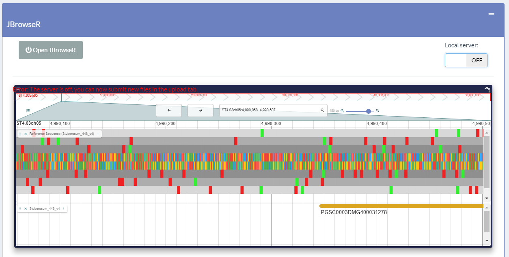

## Genes table

If you uploaded the GFF3 file in the `Input data` session, a table will be available with annotation information  inside the range selected in the linkage map.

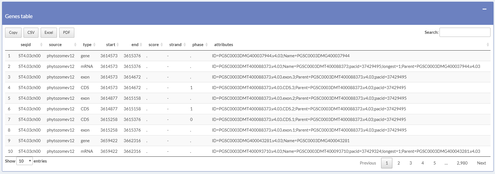

# Map Browser

This module goal is to provide tools to explore the linkage map proprieties. The sessions to select the phenotypes and the linkage group and to display the QTL profile are the same already described in the `QTL Browser`

## Map

In this session it is plotted the parents haplotypes and linkage map related to the range selected in the `map range (cM)`. If reference and alternative alleles information are present in the uploaded linkage map files, the variants are represented with different colors for each nucleotide (A, T, C and G) or indel (-). If this information is not present, red and white will differentiate the biallelic sites. The dots position and color represents the dosage number.

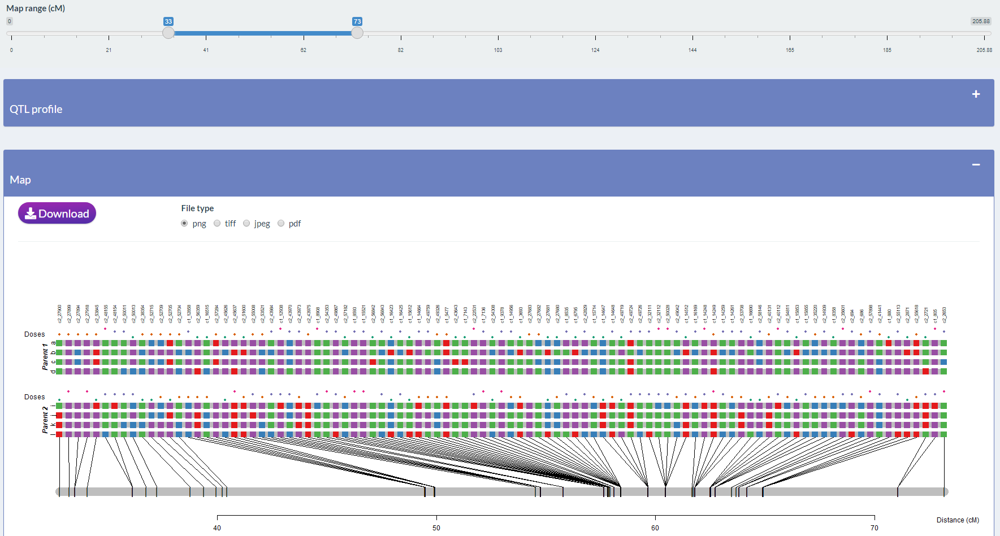

### Parents haplotypes table

The parents haplotypes information used to build the graphic can be download in this session in table format:

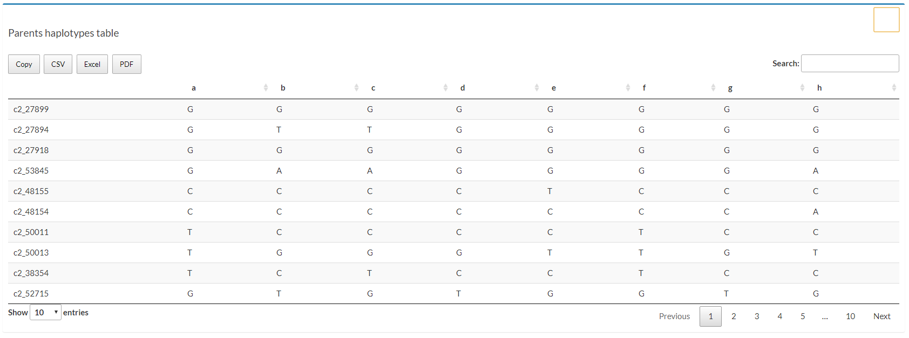

## Map summary

VIEWpoly also provides a table with the linkage map main characteristics:

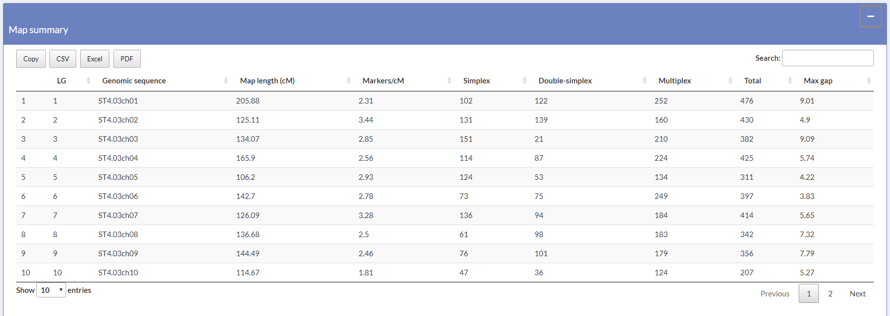

And the linkage map draw:

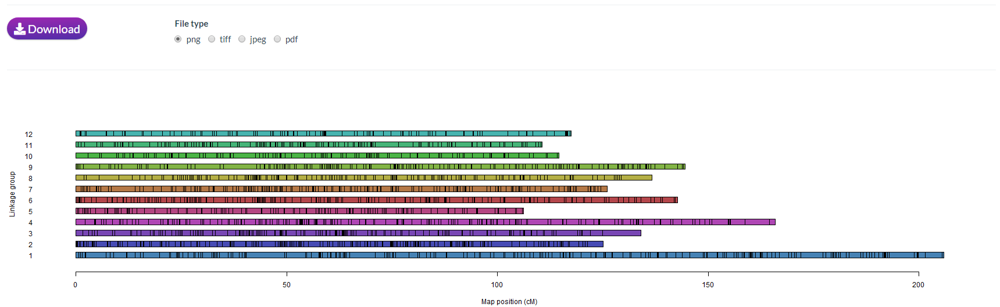


